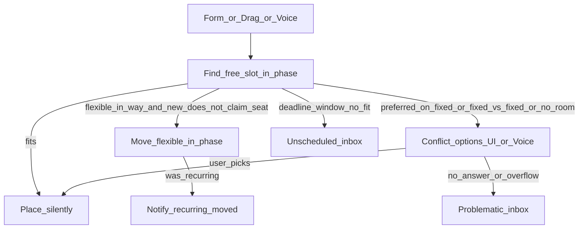

# Specification: Conflict rules & placement decisions

**Status:** product contract for the scheduling redesign (engine/UI implementation follows roadmap §2+).  
**Language:** English  
**Last updated:** September 2026  

This document is the contract for **when to ask**, **option ids**, and **Unscheduled vs Problematic**. Who moves, and which edits write slots at all, live in [spec-incremental-placement.md](spec-incremental-placement.md) (target; the live engine still full-replans). [task-scheduling-test-matrix.md](task-scheduling-test-matrix.md) follows the live engine until that target ships. Queue, Google sync, diff/undo, and settings that are still accurate live in [spec-intelligent-scheduling.md](spec-intelligent-scheduling.md).

---

## 1. Goals

- Decide placement from **task type** + **preferred time**, not numeric priority.
- Prefer **silent** resolution when the outcome is unambiguous.
- Ask only when the user must choose (structured option ids; UI/Voice later).
- Never lose work: no-reply or overflow → **Problematic**, not a silent drop.
- Keep **Unscheduled** as the intentional “decide later” inbox (separate from Problematic).

## 2. Non-goals

- Restoring priority-based displacement as the main scheduler rule.
- Habitica-style RPG / social leaderboards.
- Rewriting STT / mic capture.
- Pixel-perfect Problematic UI (later polish) — done: conflict-style sheet cards + banner.

---

## 3. Actors

| Actor | Meaning | Relocatable by engine? |
|--------|---------|-------------------------|
| **Fixed** | Exact start/end; user or app-created anchor | No |
| **Google / external** | Imported or foreign calendar busy | No (same as fixed for occupancy) |
| **Flexible** | Movable one-off / admin task in a phase (or wake/sleep) | Yes, within phase |
| **Recurring** | Series occurrence in a phase | Yes, within phase; move is visible |

**Priority** (API/UI field) is **ignored for placement** (soft-deprecated). Tie-break for “already seated” is existing placement / earlier `createdAt` when both are being placed in the same pass without a prior seat.

Form create, drag, and Voice share this contract (same decision layer; implementation in later roadmap items).

---

## 4. Decision table

| Situation | Outcome |
|-----------|---------|
| Free slot at preferred (or earliest if no preferred) | Place silently |
| New **flexible** preferred collides with **already seated flexible** | Target: claimant takes the interval; only the overlapped task moves ([incremental placement](spec-incremental-placement.md)). Live engine until that ships: seated stays; new finds the next free slot |
| Flexible (or recurring) in the way of a placement that **wins** (e.g. after user picks `move_other`) | Move the flexible silently within phase |
| **Recurring** occurrence moved to free a hole or dodge an anchor | Place + **notify** (in-app toast, not push) |
| **Recurring** cannot fit in phase/horizon after moves | **Problematic** (not Unscheduled) |
| New item preferred **exactly** on occupied **fixed** / Google busy | **Ask** (conflict options) |
| New item has **no** preferred, or preferred elsewhere; fixed/Google occupies a clock | **Silently dodge** fixed/Google; take next free slot |
| **Fixed vs fixed** overlap (create or drag) | **Always ask**; never silent overlap |
| Phase full / no hole after silent flexible shifts | **Ask**; if no answer → Problematic |
| Deadline / From–Until with **no fit** (user intentional window) | Stay / land in **Unscheduled** (overdue tone as today); **not** Problematic |
| User **dismisses** conflict UI or never answers (incl. Voice) | Target work → **Problematic** |

The diagram is the live full-replan engine. The target flow is [spec-incremental-placement.md](spec-incremental-placement.md) §4.

---

## 5. Preferred-first placement

1. If the item has a preferred start/end, try that **exact** clock interval inside the phase ∩ wake/sleep ∩ From/Until.
2. If that interval is free → place there.
3. If occupied by a **seated flexible** → the claimant takes that interval; only the overlapped task looks for the next free hole ([incremental placement](spec-incremental-placement.md)). No cascade.
4. If occupied by **fixed** / Google and preferred is **exactly** that busy interval → conflict options (§6).
5. If no preferred → earliest valid slot; always dodge fixed/Google silently.

Split (`allowSplit` ∧ settings) remains allowed when contiguous fit fails; split does not override fixed anchors.

---

## 6. Conflict options (structured ids)

Engine/API returns structured options; Groq (or copy) only **phrases** them. Applying uses existing move / skip / patch APIs.

| Id | Intent |
|----|--------|
| `move_other` | Keep the new/target placement; relocate the other movable |
| `move_new` | Keep the other; place the new item elsewhere (or cancel its preferred claim) |
| `skip_occurrence` | Skip this occurrence / day for a recurring series |
| `leave_problematic` | Park in Problematic without applying a slot |

Further ids may be added later; these are the baseline contract.

**No-reply on the conflict sheet:** closing the sheet or navigating away parks the claimant in **Problematic** when no free hole exists. An unanswered Voice clarification is different: the task is created from the fields already understood, then follows normal placement ([incremental placement](spec-incremental-placement.md) §10).

---

## 7. Unscheduled vs Problematic

| | **Unscheduled** | **Problematic** |
|--|-----------------|-----------------|
| Meaning | Intentional “don’t forget / decide later” | Fell out of schedule after create, drag, replan, or unanswered conflict |
| Flag / model | Existing `isUnscheduled` | `isProblematic` (distinct boolean; Calendar banner/sheet) |

| Typical entry | User creates without scheduling; deadline window with no fit | Overflow; dismiss conflict; recurring won’t fit |
| Actions (product) | Done / Skip (cancel) / Do now / Open (§7) | Open task; move / skip / resolve (roadmap §3–4) |
| UI default | Tasks page inbox | Calendar banner/chip + sheet (placement flexible until §3) |

---

## 8. Triggers

Which edits read or write seats is defined in [spec-incremental-placement.md](spec-incremental-placement.md) §5. Form, drag, and voice share that table. A small edit does not replan every open flexible. No answer on the conflict sheet still parks the claimant in Problematic (§7); already seated tasks stay.

---

## 9. Implementation note

Roadmap **§2–§8** shipped the live full-replan engine, Problematic inbox, shared conflict sheet, Voice, and background extend. The target write-set is [spec-incremental-placement.md](spec-incremental-placement.md). Do not add priority-based displacement. A claimant overlapping a seated flexible is not a priority bump: only that overlapped task moves.
