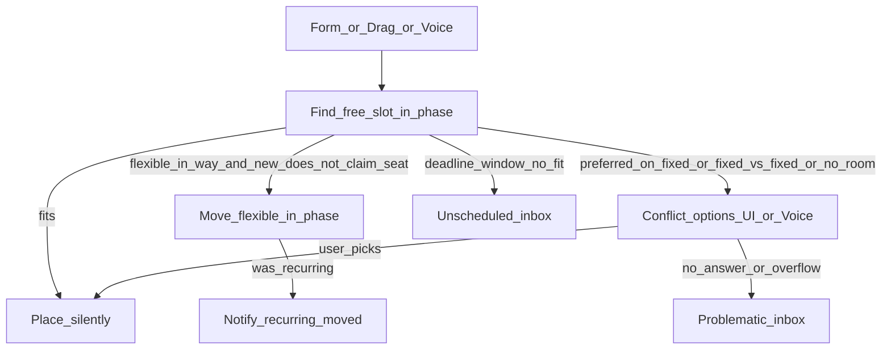

# Specification: Conflict rules & placement decisions

**Status:** product contract for the scheduling redesign (engine/UI implementation follows roadmap §2+).  
**Language:** English  
**Last updated:** September 2026  

This document is the **single source of truth** for who moves silently, who asks the user, and when a task lands in **Unscheduled** vs **Problematic**. Placement expectations in [task-scheduling-test-matrix.md](task-scheduling-test-matrix.md) follow these rules. Queue, Google sync, diff/undo, and settings that are still accurate live in [spec-intelligent-scheduling.md](spec-intelligent-scheduling.md) (placement/ordering there defers here).

---

## 1. Goals

- Decide placement from **task type** + **preferred time**, not numeric priority.
- Prefer **silent** resolution when the outcome is unambiguous.
- Ask only when the user must choose (structured option ids; UI/Voice later).
- Never lose work: no-reply or overflow → **Problematic**, not a silent drop.
- Keep **Unscheduled** as the intentional “decide later” inbox (separate from Problematic).

## 2. Non-goals

- Restoring priority-based displacement as the main scheduler rule.
- Habitica-style RPG / social leaderboards.
- Rewriting STT / mic capture.
- Pixel-perfect Problematic UI (later polish) — done: conflict-style sheet cards + banner.

---

## 3. Actors

| Actor | Meaning | Relocatable by engine? |
|--------|---------|-------------------------|
| **Fixed** | Exact start/end; user or app-created anchor | No |
| **Google / external** | Imported or foreign calendar busy | No (same as fixed for occupancy) |
| **Flexible** | Movable one-off / admin task in a phase (or wake/sleep) | Yes, within phase |
| **Recurring** | Series occurrence in a phase | Yes, within phase; move is visible |

**Priority** (API/UI field) is **ignored for placement** (soft-deprecated). Tie-break for “already seated” is existing placement / earlier `createdAt` when both are being placed in the same pass without a prior seat.

Form create, drag, and Voice share this contract (same decision layer; implementation in later roadmap items).

---

## 4. Decision table

| Situation | Outcome |
|-----------|---------|
| Free slot at preferred (or earliest if no preferred) | Place silently |
| New **flexible** preferred collides with **already seated flexible** | Seated stays; new finds next free slot in phase (silent) |
| Flexible (or recurring) in the way of a placement that **wins** (e.g. after user picks `move_other`) | Move the flexible silently within phase |
| **Recurring** occurrence moved to free a hole or dodge an anchor | Place + **notify** (in-app toast, not push) |
| **Recurring** cannot fit in phase/horizon after moves | **Problematic** (not Unscheduled) |
| New item preferred **exactly** on occupied **fixed** / Google busy | **Ask** (conflict options) |
| New item has **no** preferred, or preferred elsewhere; fixed/Google occupies a clock | **Silently dodge** fixed/Google; take next free slot |
| **Fixed vs fixed** overlap (create or drag) | **Always ask**; never silent overlap |
| Phase full / no hole after silent flexible shifts | **Ask**; if no answer → Problematic |
| Deadline / From–Until with **no fit** (user intentional window) | Stay / land in **Unscheduled** (overdue tone as today); **not** Problematic |
| User **dismisses** conflict UI or never answers (incl. Voice) | Target work → **Problematic** |

---

## 5. Preferred-first placement

1. If the item has a preferred start/end, try that **exact** clock interval inside the phase ∩ wake/sleep ∩ From/Until.
2. If that interval is free → place there.
3. If occupied by a **seated flexible** (or other movable that must keep the seat under §4) → take the **next free** contiguous slot that day, then later days in horizon (silent).
4. If occupied by **fixed** / Google and preferred is **exactly** that busy interval → conflict options (§6).
5. If no preferred → earliest valid slot; always dodge fixed/Google silently.

Split (`allowSplit` ∧ settings) remains allowed when contiguous fit fails; split does not override fixed anchors.

---

## 6. Conflict options (structured ids)

Engine/API returns structured options; Groq (or copy) only **phrases** them. Applying uses existing move / skip / patch APIs.

| Id | Intent |
|----|--------|
| `move_other` | Keep the new/target placement; relocate the other movable |
| `move_new` | Keep the other; place the new item elsewhere (or cancel its preferred claim) |
| `skip_occurrence` | Skip this occurrence / day for a recurring series |
| `leave_problematic` | Park in Problematic without applying a slot |

Further ids may be added later; these are the baseline contract.

**No-reply:** closing the sheet, navigating away, or not choosing via Voice → treat as unresolved → **Problematic** for the work that could not be placed.

---

## 7. Unscheduled vs Problematic

| | **Unscheduled** | **Problematic** |
|--|-----------------|-----------------|
| Meaning | Intentional “don’t forget / decide later” | Fell out of schedule after create, drag, replan, or unanswered conflict |
| Flag / model | Existing `isUnscheduled` | `isProblematic` (distinct boolean; Calendar banner/sheet) |

| Typical entry | User creates without scheduling; deadline window with no fit | Overflow; dismiss conflict; recurring won’t fit |
| Actions (product) | Done / Skip (cancel) / Do now / Open (§7) | Open task; move / skip / resolve (roadmap §3–4) |
| UI default | Tasks page inbox | Calendar banner/chip + sheet (placement flexible until §3) |

---

## 8. Triggers (same rules)

| Trigger | Behavior |
|---------|----------|
| **Form create/update** | Find slot → silent / ask / unscheduled / problematic per §4 |
| **Drag** | Replan affected phases that civil day; flexible silent shift if a hole exists; else ask / problematic; recurring move → notify |
| **Voice** | After parse, same placement + conflict builder; `needs_conflict_choice` → same options; spoken or tap pick; no-reply → Problematic |

---

## 9. Implementation note

Roadmap **§2–§8** shipped: type + preferred placement, Problematic inbox, shared conflict sheet, Voice, drag replan, Unscheduled actions, and background recurring extend (Generate/Review is cleanup, not liveness). Do not add new priority-displacement behavior.
