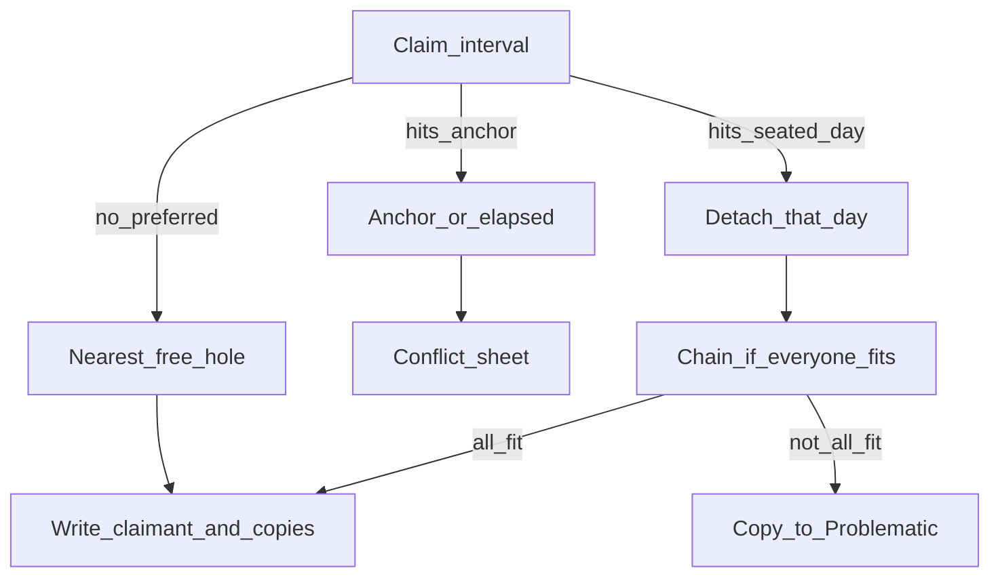

# Специфікація: інкрементальне розміщення

**Статус:** цільовий контракт. Створення й геометричне редагування вже йдуть через крок посадки і не ставлять `full_replan`. Generate, Clear і `POST /schedule-jobs/replan` досі викликають `engine.run`.

**Мова:** українська.

**Оновлено:** жовтень 2026.

Цей документ — джерело правди для того, **кого читаємо і кого пишемо** під час посадки в календар. [spec-conflict-rules.md](spec-conflict-rules.md) лишається контрактом інбоксів (Unscheduled і Problematic), ідентифікаторів опцій і правила «немає відповіді → Problematic». Хто кого зрушує і які події взагалі запускають посадку — тут. Черга, Google RRULE і сірі минулі події — у [spec-intelligent-scheduling.md](spec-intelligent-scheduling.md).

---

## 1. Навіщо

Повний перерахунок на дрібну зміну навантажує сервер і переписує задачі, які користувач уже посадив. Через це з’їжджають винятки, драги й уже узгоджені слоти.

Ціль:

- при створенні задача сама знаходить місце і вважається заседженою;
- далі її слот не чіпається, доки хтось прямо не зайняв цей інтервал;
- зрушується подія того дня, чиє місце зайняли, а не вся задача;
- третю теж зрушуємо, лише якщо після цього місце є в усіх.

---

## 2. Журнал рішень

Відповіді на питання планування. Нормативні правила нижче їм відповідають.

### Хвиля 0

1. **Хто лишається на спірному інтервалі.** Той, хто заявив інтервал (нова задача, drag, фіксована, якір Google або звички). Зрушується лише той, хто там сидів.
2. **Що таке «зайняла місце».** Будь-яке перетинання заявленого інтервалу з уже записаним слотом. Заявлений інтервал — це preferred, час драга, годинник фіксованої, подовжений кінець або час якоря. Посадка в найближчу вільну дірку нікого не займає.
3. **Скільки задач зрушити.** Спочатку тих, чий слот перетинає заявлений інтервал. Якщо вільна дірка є лише за рахунок третьої, і можна зрушити ланцюжок так, щоб місце лишилось у кожного, зрушуємо і третю. Якщо так зібрати не виходить, третю не чіпаємо, а подія без місця йде в Problematic.
4. **Повний перерахунок і кнопка Generate.** Їх немає. Місце з’являється при створенні і при пізнішій заявці на інтервал. Окремої кнопки, preview і undo останньої генерації в продукті немає. Недосаджених «на потім» не тримаємо.

### Хвиля 1

5. Гнучка без preferred сідає в найближчу дірку фази і одразу заседжена. Наступне створення зрушить її лише якщо заявить інтервал поверх неї.
6. Preferred вільний: пишемо лише цю задачу.
7. Preferred на fixed, зовнішньому Google або звичці: якір не рухається, лишається конфлікт-шит (`move_new`, `skip_occurrence` для серії, `leave_problematic`).
8. Preferred на заседженій гнучкій або входженні серії: нова забирає інтервал. Одноразова задача зрушується сама. День серії зникає з серії, поруч створюється ідентична неповторювана задача: назва, опис, фаза, тривалість, колір, нагадування, усе крім повторення. Копія шукає дірку; ланцюжок за правилом 3. Місця немає — день із серії все одно прибраний, копія в Problematic.
9. Немає дірки у фазі або горизонті — Problematic. Вікно дедлайну або From–Until без місця — Unscheduled.
10. Фіксована сідає на свій годинник. Якщо під нею гнучка — зрушується лише подія цього дня за правилом 8, не вся задача. Фіксована на фіксовану або на Google — завжди питання, тихого накладання немає.
11. Створення Unscheduled або Problematic: слота немає, інших не читаємо і не пишемо.
12. Форма і голос саджають за одним правилом.

### Хвиля 2

13. Косметика не рухає слот: назва, опис, колір, нагадування, visibility, transparency, location, priority. Той самий Google-івент оновлюється на місці.
14. Довша тривалість подовжує кінець на місці. Хто потрапив під новий кінець — зрушується. Коротша тривалість нікого в дірку не підтягує.
15. Зміна preferred у формі: якщо задачу можна посадити в цей час, зокрема зрушивши інших так, щоб місце лишилось у всіх, саджаємо туди. Якщо ні — лишаємо старий слот, нічого не пишемо.
16. Зміна фази: слот ще всередині нової фази — не рухаємо. Випав — нове місце шукає лише ця задача. Інші в старій фазі лишаються.
17. From, Until, дедлайн, дні тижня: слот ще у вікні — не рухаємо. Випав — пересаджуємо лише її. Вікно вже минуло — Unscheduled, інших не чіпаємо.
18. Split і розмір chunk перерізають лише цю задачу, і лише якщо суцільний слот більше не валідний. Новий шматок, що ліг на сусіда, зрушує лише сусіда.
19. Редагування вже Unscheduled або Problematic розклад не чіпає. Вихід з інбоксу (Schedule, Do now, зняти problematic) — посадка лише цієї задачі.

### Хвиля 3

20. Drag або resize гнучкої на вільне місце оновлює цей слот і preferred. Інших не читаємо.
21. Drag на зайняте: перемагає та, яку тягнуть. Та, що сиділа, зрушується за правилом 8.
22. Drag дня серії питає: лише цей день чи вся серія. Лише цей день — прибрати цей день із серії і створити ідентичну неповторювану задачу на новому часі. Вся серія — зсунути цей день і всі наступні; входження до нього лишаються на старому годиннику. Серія розрізається: стара частина закінчується перед цим днем, далі йде нова повторювана задача з новим часом. Копія кожного дня окремо не створюється.
23. Drag фіксованої на гнучку: фіксована сідає, зрушується лише перекрита гнучка. Drag фіксованої на іншу фіксовану або Google — питання.
24. Буфер навколо fixed лишається м’яким. Пошук дірки спочатку уникає його, потім може ним скористатися. Drag у буфер дозволений. Буфер сам по собі нікого не витісняє.
25. Drag зовнішньої Google-події або звички задачі не перераховує. Вхідне перекриття — хвиля 8.
26. Голосові `shift` і `move` збігаються з драгом.

### Хвиля 4

27. Створення серії саджає всі входження до горизонту одразу. Інші задачі зрушуються лише в ті дні, де нове входження сіло на них.
28. Фоновий extend лише дописує дні за краєм уже поставленого. Поставлені дні не перечитує. `skippedOccurrenceYmds` лишаються дірками.
29. Зміна патерну, днів тижня або годинника серії пересаджує лише майбутні відкриті дні цієї серії. Минулі дні й skip-дні лишаються. Інші задачі зрушуються лише якщо нове входження сіло на них.
30. День серії не влазить: пропускаємо цей день, решта серії лишається на своїх місцях. Наступні дні серії не зсуваються.
31. Конфлікт годинника серії з fixed або Google — окремий шит на кожен такий день, не один на всю серію.
32. `completed` і `canceled` для серії не чіпають слоти й Google і не саджають сусідів у дірки.
33. Видалення серії прибирає її майбутні слоти. Сусідів у дірки не підтягує.

### Хвиля 5

34. Опції лишаються: `move_other`, `move_new`, `skip_occurrence`, `leave_problematic`. `move_other` зрушує лише тих, на кого сіли, без решти календаря. Проти якоря `move_other` немає.
35. Закриття шита без відповіді: ця задача в Problematic. Уже заседжені не рухаються.
36. Do now і Schedule з Unscheduled саджають лише цю задачу від «зараз».
37. Problematic Move записує обраний слот як місце. Далі він не переглядається, доки хтось його не займе.
38. Skip одного входження прибирає цей слот або день. У дірку нікого не саджаємо. Серію не перебудовуємо.

### Хвиля 6

39. `completed` і `canceled`: слоти не переписуємо, дірки не заповнюємо.
40. Повернення в `todo`: старий майбутній слот ще валідний — лишаємо його. Ні — саджаємо лише цю задачу.
41. `in_progress`: уже минула частина входження лишається на місці. Хвіст після `now` можна зрушити, як подію цього дня. Інші дні серії не чіпаємо.
42. Видалення гнучкої або фіксованої прибирає її події. Інші не пересідають. Звільнений час доступний наступному пошуку дірки.

### Хвиля 7

43. Кнопки Generate / Review немає. Немає й окремого проходу, який досаджує «забутих».
44. Прибрано разом із кнопкою: Generate не переписує ні заседжених, ні винятки, бо самого проходу немає.
45. Clear прибирається разом із Generate. Окремого стирання всіх відкритих слотів немає.
46. Undo останньої генерації прибирається разом із Generate. Окремого undo на create, drag чи витіснення немає.
47. Фоновий тік лише дописує край горизонту повторюваних. Зміна wake, sleep, фази, буфера чи довжини горизонту сама по собі нікого не пересаджує.

### Хвиля 8

48. Нова або перенесена подія Google у момент синхронізації намагається зрушити перекриті події цього дня, з ланцюжком за правилом 3. Якщо зібрати так, щоб усі мали місце, не виходить — ці події в Problematic. Інші дні їхніх задач не чіпаємо.
49. Зміна години блоку звички — те саме, що Google: зрушуються лише перекриті.
50. Редагування фази пересаджує по одній лише ті задачі цієї фази, чий слот випав з нового вікна. Видалення фази місця не переписує: слоти лишаються.
51. Таймзона, wake, sleep, weekend, буфер, дозвіл split, довжина горизонту застосовуються до наступного пошуку дірки. Уже заседжена задача лишається, навіть якщо новий режим зробив її слот «невдалим», доки її явно не редагують і не прийде заявка поверх неї.
52. Дві посадки одночасно серіалізуються замком на користувача. Друга бачить слот першої як зайнятий. Замка «перепиши всіх» немає.

### Хвиля 9

53. Голос іде тим самим кроком, що форма і календар, включно з ланцюжком, якщо після нього місце є в усіх. Окремого голосового повного реплану і кнопки Generate немає.

### Хвиля 10

54. Цей файл — контракт посадки. [spec-conflict-rules.md](spec-conflict-rules.md) §4 (хто зрушується) і §8, тригери в [spec-intelligent-scheduling.md](spec-intelligent-scheduling.md) §5 і [task-creation-rules.md](task-creation-rules.md) §3 та §7.1 посилаються сюди.
55. Мова документа — українська.
56. Навмисно не змінюється: пріоритет не впливає на місце; звичка не є задачею; минулі події app-календаря сірі; повністю закінчені слоти не переписуються; Google-серія минулого закривається `UNTIL`, майбутнє пишеться окремо; буфер не є подією календаря.

### Google, Problematic, resolved

57. Місце наших задач живе в базі. Кожна успішна зміна одразу йде в Google. Чужі події лишаються якорем.
58. Правка часу, назви або опису нашої події в Google новіша за застосунок і стає правдою. Видалення в Google за замовчуванням у застосунок не переноситься. Окреме налаштування вмикає синхронізацію видалення, вимкнене з коробки.
59. Чужа подія лягла на наш день: чужу не рухаємо, нашу пробуємо посадити в інше місце. Немає місця — Problematic.
60. Немає слота — події в Google немає. Поки копія в Problematic, інстанс цього дня в Google видалений.
61. День лишається в серії, якщо його час не змінився. Змінився час або інше, через що це вже не той самий день серії — день знімається з серії, з’являється окрема неповторювана подія. Окрема подія в Google створюється лише коли в копії є слот.
62. Помилка Google, зокрема ліміт записів, не відкочує базу. Запам’ятовуємо невідправлену зміну і доганяємо фоном. Якщо до успішної спроби користувач встиг змінити цю подію в Google, невідправлене скасовуємо і підтягуємо Google.
63. Problematic і resolved — значення одного enum на задачі, не булеві прапорці. Статуси `todo` / `in_progress` / `completed` / `canceled` лишаються окремо.
64. У Problematic потрапляє копія одного дня. Серія пам’ятає пропуск у `skippedOccurrenceYmds`. На копії зберігаються код причини, день, вихідний інтервал, id серії і Google-id, якщо він встиг з’явитись.
65. Кілька днів — кілька копій. Одноразова задача без місця сама стає Problematic, її старий слот знімається.
66. Запис живе в базі після закриття застосунку. День копії вже в минулому — копію прибираємо. Щойно є дірка, одразу саджаємо всіх проблемних, які вміщаються, від найстарішої. Resolved не чіпаємо.
67. Голос поставив уточнення, а відповіді немає: створюємо задачу з того, що вже зрозуміли, якщо цього досить, і далі йде звичайне створення. Conflict-шит без відповіді лишає заявника в Problematic, якщо вільного слота немає.
68. Resolve лишає задачу другим шаром на тому самому слоті. Enum стає `resolved`. Зв’язок із серією лишається. Нова задача цей час не займає: шукає іншу дірку, не вмістилась — сама Problematic.
69. Знову в Problematic задача потрапляє лише після того, як перестала бути `resolved`.
70. Skip із Problematic не показує копію на календарі. Спочатку день записується як пропуск серії, потім копія і її подія в Google видаляються.

---

## 3. Актори

| Актор | Можна зрушити цією специфікацією? |
|--------|-----------------------------------|
| Заседжена гнучка або одне входження серії | Так, лише подія того дня, який перетнули. Інші дні задачі лишаються |
| `in_progress` | Минула частина входження — ні. Хвіст після `now` — так |
| Fixed | Ні. Сама фіксована може витіснити гнучку, коли сідає на свій годинник |
| Google / зовнішня подія | Ні. Може витіснити гнучку в момент синхронізації. Немає дірки — гнучка стає Problematic |
| `resolved` | Ні. Лишається на своєму слоті, навіть якщо він збігається з іншою задачею |
| Блок звички | Ні. Може витіснити гнучку, коли змінюється його година |
| Unscheduled | Слота немає, доки користувач явно не саджає |
| Problematic | Слота немає, доки не з’явиться дірка або користувач сам не вирішить. Дірка саджає всіх, хто вміщається |

Пріоритет як і раніше на місце не впливає.

**Заседжена** — є ще відкритий слот (`scheduledEndTime` у майбутньому) або фіксований годинник. Повністю закінчений слот не є місцем, яке треба захищати, і не переписується.

---

## 4. Алгоритм одного кроку

Крок саджає заявника і зрушує лише події днів, без яких усі не вміщаються.

1. Визначити **заявлений інтервал**. Немає preferred і це пошук дірки — спочатку дні, де вже є гнучкі/series у цій фазі (сира дірка). Якщо дірки немає: перевірити **вільні хвилини** фази (`довжина фази − усі слоти, включно з fixed/Google/habits`). Якщо вистачає на нову задачу — лише в розрахунку плану зсунути гнучкі між фіксованими й посадити нову (бажано ближче до preferred); у БД пишемо тільки успішний план. Лише якщо жоден зайнятий день не вміщає — дірка на порожньому дні.
2. Вільна дірка не перетинає якір, уже минулу частину `in_progress`, інший відкритий слот. Буфер спочатку обходимо, якщо інакше місця немає — дірка в буфері допустима.
3. Заявлений інтервал перетинає якір або вже минулу частину `in_progress` — нічого не пишемо, відкриваємо шит.
4. Заявлений інтервал перетинає гнучку або хвіст `in_progress`. Заявник сідає сюди. Одноразова задача зрушується сама, без копії. День серії з серії прибирається, і створюється ідентична неповторювана задача на новому місці. Інші дні серії не зсуваються. Виглядає як та сама подія, зсунута в один день.
5. Нову одноразову задачу саджаємо у вільну дірку. Якщо місце є лише коли зрушити ще чиюсь подію, пробуємо ланцюжок. Ланцюжок записуємо, лише якщо після нього місце є в кожної зачепленої події. Інакше третіх не рухаємо. День із серії вже прибраний, копія без дірки йде в Problematic.
6. Заявник сам не влазить у фазу, горизонт або власне вікно дедлайну — його в Problematic або Unscheduled за §6. Інших не пишемо.
7. Повністю закінчені слоти цей крок не видаляє і не зміщує.

Паралельні кроки одного користувача йдуть чергою. Другий крок бачить запис першого.

---

## 5. Подія → кого читаємо → кого пишемо

«Нікого» означає: слоти інших задач не читаємо для рішення і не записуємо.

| Подія | Читаємо | Пишемо |
|--------|---------|--------|
| Створення гнучкої, preferred вільний | Перетин preferred з якорями й слотами | Лише її слот |
| Створення гнучкої без preferred | Вільні дірки її фази; якщо дірки немає, але ліве ущільнення гнучких (і series-day для one-off claim) у вікні фази відкриває місце — зрушуємо їх. Recurring claim чужі series-master не зрушує | Її слот у найближчій дірці; за потреби зсуви ущільнених flexible |
| Створення гнучкої, preferred на гнучкій | Перекриті події цього дня | Її слот; з кожної перекритої події — нова така сама задача в дірку, або Problematic, якщо ланцюжок не вміщає всіх |
| Створення, preferred на якір або на вже минулу частину `in_progress` | Якорі | Нічого, доки користувач не відповість |
| Створення фіксованої без перетину з гнучкою | Перетин її годинника | Лише фіксовану |
| Створення фіксованої поверх гнучкої | Події цього дня | Фіксовану; з кожної перекритої події — нову задачу в дірку або Problematic |
| Фіксована поверх фіксованої або Google | Обидва якорі | Нічого, доки немає відповіді |
| Створення Unscheduled або Problematic | Нікого | Лише прапори задачі |
| Косметичний PATCH | Нікого | Поля задачі й текст того самого Google-івента |
| Довша тривалість | Події, які перетинає новий кінець | Кінець цієї задачі; з перекритих подій — нові задачі |
| Коротша тривалість | Нікого | Новий кінець цієї задачі |
| Зміна preferred | Чи вміщається цей час, якщо зрушити інших і всі лишаться з місцем | Якщо так — новий слот і потрібні зрушення. Якщо ні — старий слот, запису немає |
| Зміна фази, слот ще валідний | Нікого | Фазу |
| Зміна фази, слот випав | Дірки лише цієї задачі | Лише її |
| Вікно ще містить слот | Нікого | Поля вікна |
| Вікно виштовхнуло слот | Дірки лише цієї задачі | Лише її, або Unscheduled якщо вікно минуло |
| Зміна split | Сегменти цієї задачі | Лише її сегменти; перекриту, якщо новий шматок ліг на нього |
| Вихід з інбоксу | Дірки лише цієї задачі | Лише її |
| Drag або resize на вільне | Нікого | Цей слот і preferred |
| Drag на зайняте | Перекрита задача | Перетягнуту і перекриту |
| Drag одного дня серії | Питання: цей день чи вся серія | Цей день: прибрати його з серії і створити неповторювану копію. Вся серія: зсунути цей день і наступні, попередні лишити |
| Drag фіксованої на якір | Якорі | Нічого, доки немає відповіді |
| Drag у буфер | Нікого | Цей слот |
| Drag зовнішнього Google або звички | Нікого | Лише цю зовнішню подію |
| Голос `shift` / `move` | Те саме, що drag | Те саме, що drag |
| Створення серії | Кожне входження до горизонту | Входження серії; перекритих лише перетнутих днів |
| Extend | Відсутні дні за краєм | Лише нові дні серії |
| Зміна патерну, днів або годинника серії | Майбутні відкриті дні цієї серії | Лише ці дні; перекритих нових інтервалів |
| День серії не влазить | Цей день | Skip цього дня; решта серії без змін |
| Конфлікт серії з якорем | Якір цього дня | Нічого до відповіді на цей день. Інші дні серії не чекають цього шита |
| Complete або cancel | Нікого | Статус. Слоти й сусіди без змін |
| Повернення в `todo`, слот валідний | Нікого | Статус |
| Повернення в `todo`, слот невалідний | Дірки цієї задачі | Лише її |
| `in_progress` | Нікого | Статус. Минуле входження лишається; рухомий лише хвіст після `now` |
| Видалення задачі або серії | Її майбутні слоти | Видалити їх. Сусідів не заповнювати |
| Skip входження | Цей слот або день | Прибрати його. Дірку не заповнювати |
| Do now / Schedule | Дірки цієї задачі від зараз | Лише її |
| Problematic Move | Обраний вільний слот | Лише її |
| Закриття conflict-шита без відповіді і без дірки | Нікого | Заявника в Problematic |
| Голос без відповіді на уточнення | Звичайне створення з уже відомих полів | Задачу, якщо з них можна зібрати створення |
| Звільнилась дірка | Усі Problematic, які в неї вміщаються, від найстарішої | Їхні слоти. Resolved не читаємо для запису |
| Правка нашої події в Google | Час, назва, опис цієї події | Ті самі поля задачі. Видалення ігноруємо, доки налаштування вимкнене |
| Generate / Review / Undo генерації / Clear | Нікого | Прибрані з продукту. Запису немає |
| Зміна налаштувань або видалення фази | Нікого | Налаштування або фазу. Слоти без змін |
| Редагування фази | Задачі фази, чий слот випав | Лише їх, по одній |
| Google або звичка перекрили гнучку | Події перекритих днів | Одразу спробувати посадити їхні копії, з ланцюжком якщо всі вміщаються. Ні — Problematic |

---

## 6. Інбокси й шит

Сенс інбоксів не змінюється.

| Куди | Коли |
|------|------|
| Unscheduled | Користувач так створив, або вікно дедлайну / From–Until уже не вміщає цю задачу |
| Problematic | Немає дірки у фазі чи горизонті; витіснена не знайшла дірку; користувач закрив conflict-шит або обрав `leave_problematic` |

Шит відкривається лише коли заявник уперся в якір, у вже минулу частину `in_progress` або в іншу фіксовану. Гнучка поверх гнучкої вирішується мовчки: зрушується подія дня, за потреби ланцюжком.

| Id | Дія |
|----|-----|
| `move_new` | Заявник іде в найближчу вільну дірку. Той, хто сидів, лишається |
| `move_other` | Лише проти іншої рухомої, якщо шит усе ж показаний. Зрушити лише перекритих, без решти календаря |
| `skip_occurrence` | Пропустити цей день серії. Решту серії не зсувати |
| `leave_problematic` | Заявник у Problematic, слота немає |

Закриття conflict-шита без вибору залишає заявника в Problematic, якщо вільної дірки немає. Уже записані слоти інших не відкочуються. Голос, який не дочекався уточнення, сюди не входить: він створює задачу з уже відомих полів.

---

## 7. Повторювані

- Створення **спочатку планує** кожен civil day горизонту (`recurringScheduleHorizonDays`) окремо проти поточного календаря (dry-run: дірка / pack-shift / Problematic), **без** запису серії з дня 1.
- Зсунутий one-off (`parentSeriesId` / `seriesGroupId`) лишає **home clock** master-серії на цей день: пошук дірки вважає зайнятими actual∪home. Для recurring claim дірка **всередині** кластера peers (хибний розрив стеку) не береться — спочатку pack.
- **Recurring claim не зсуває master іншієї recurring-серії** (інші series — стіни). Pack/reseat для нової серії рухає лише `flexible` (зсунуті one-off). Preferred поверх чужої series → наступна дірка / pack flexibles, не `shift` того master. One-off claim як і раніше може detach/shift один день чужої series.
- На день: якщо є preferred — спочатку цей clock; якщо не влізло — дірка/ущільнення того дня (інший час ок, ближче до preferred краще). Problematic на день лише коли обидва кроки не дали місця.
- Після незалежного плану по днях обирається primary clock (найбільша група `HH:mm` серед **зайнятих** днів фази; порожні дні горизонту з діркою на старті фази в голосуванні не домінують). Дні з іншим clock (або без місця) **переплануються** з preferred = primary: якщо exact seat вдається (зокрема зсувом **flexible** peer’а того дня) — день входить у master. Лише після цього зсуви застосовуються; дні з однаковим `HH:mm` об’єднуються в recurring `Task` (найбільша група — master); інші clock → sibling у тому ж `seriesGroupId`; унікальний clock → one-off; невдалі дні → Problematic one-off + skip на master. Порожній календар → зазвичай одна серія на одному clock.
- Extend дописує лише відсутні майбутні дні тим самим per-day планом і тим самим split. Кнопки Generate для цього немає. Вже записаний день не читається для перезапису.
- Зсув одного дня прибирає його з серії і створює ідентичну неповторювану задачу з тим самим `seriesGroupId`. Якщо копії немає місця, день із серії все одно знятий, копія в Problematic.
- Якщо член групи (one-off) знову сідає на master clock іншої recurring задачі тієї ж `seriesGroupId`, він зливається назад у ту серію (skip/EXDATE знімається, one-off видаляється).
- Зміна будь-чого крім часу (`scheduledStart`/`End`, тривалість) або фази знімає `seriesGroupId` / `parentSeriesId` — задача лишається унікальною назавжди (без re-merge).
- Drag «уся серія» зсуває цей день і всі наступні. Входження до нього лишаються. Стара серія закінчується перед цим днем, нова повторювана задача йде з нового часу і тим самим `seriesGroupId`.
- День, який не влазить навіть після зсуву перекритих **гнучких** (і, для one-off claim, series-day) у межах того civil day → Problematic one-off на цей день (`parentSeriesId` + skip на master). Наступний день серії шукає свій слот сам. Ніколи не сідати поверх іншого слота.
- Конфлікт із якорем питає окремо за кожен день. Відповідь за один день не переписує інші.
- Минуле входження, skip-день і закінчений слот не відновлюються і не зсуваються.
- У Google кожна локальна `Task` — окремий RRULE або one-off; минуле як і раніше закривається `UNTIL`. **DTSTART / start** recurring sync береться з **majority local clock** серед open slots (не хронологічний `open[0]`), щоб один зсунутий день не переписав усю Google-серію на чужий годинник.

---

## 8. Фон

Кнопок Generate / Review, Clear, попереднього перегляду розкладу і undo останньої генерації в цільовому продукті немає. Задача отримує місце під час створення або іншої події з §5.

- **Горизонт.** Раз на близько 20 годин дописує край горизонту повторюваних. Заседжених не перечитує.
- **Дірка.** Щойно звільнилось місце, одразу саджає всіх Problematic, які вміщаються, від найстарішої. Resolved не чіпає.
- **Прострочені копії.** Problematic, чий день уже в минулому, видаляється. Серія цей день уже пам’ятає як пропуск.
- **Google.** Невідправлені зміни повторюються фоном, доки запис не пройде. Якщо за цей час подію змінили в Google, черга для неї скасовується і в базу береться версія Google.
- Зміна налаштувань і видалення фази тік не будять.

Поки код не змінений, кнопки Generate і Clear у календарі ще є. Їх треба прибрати разом з імплементацією цього контракту.

---

## 9. Що не рухає жоден чужий слот

Косметика, коротша тривалість, skip, complete, cancel, видалення, повернення в `todo` зі ще валідним слотом, позначка `in_progress`, редагування інбокса, створення інбокса, drag на вільне місце, drag зовнішньої події, зміна налаштувань, видалення фази, закриття шита.

Видалення і skip звільняють час, але ніхто в нього не стрибає, доки наступна заявка не шукає дірку.

---

## 10. Голос

Голос не має окремого планувальника. Create, update, complete, cancel, delete, skip, move, shift, window і do now виконують рядок тієї самої таблиці §5, що й форма або календар.

Уточнення без відповіді не відправляє задачу в Problematic. Якщо з уже розпізнаних полів можна зібрати створення, задача створюється і далі йде звичайною посадкою.

---

## 11. Поза цим контрактом

Не переписується і не є новою поведінкою: пріоритет, звички як окремі блоки, сірий колір минулих подій app-календаря, збереження повністю закінчених слотів, `UNTIL` для минулого Google, буфер як не-подія.

Контракт посадки в коді: слоти пише `PlacementStepService.place` (create/edit/drag/append). Generate, Clear, Undo і `POST /schedule-jobs/replan` прибрані; `engine.run` більше не пише слоти. Косметика оновлює задачу й Google. Звільнена дірка саджає Problematic. Drag серії питає «цей день чи вся серія». Конфлікт із якорем відкриває шит. Resolve — другий шар. Google sync + `pending_google_writes`. Годинний тік дописує дні серії й чистить прострочені Problematic. [task-scheduling-test-matrix.md](task-scheduling-test-matrix.md) оновлено під placement.

---

## 12. Google, Problematic, resolved

### 12.1 Джерело правди

Наші задачі зберігаються в базі. Після успішної зміни той самий стан записується в Google. Чужі події з Google ми не переписуємо.

Користувач змінив у Google час, назву або опис нашої події. Ця правка новіша, тож база підтягує її. Видалення події в Google базу не змінює. Налаштування `syncGoogleDeletions` вмикає перенесення видалення, за замовчуванням вимкнене.

Запис у Google не пройшов. База лишається як є. Зміна стоїть у черзі і повторюється фоном. Якщо до успіху цю саму подію змінили в Google, черга для неї знімається, у базу береться Google.

Немає слота — у Google нічого не створюємо.

### 12.2 День серії в Google

День лишається частиною серії, поки його час той самий. Змінився час — день знімається з серії, і коли є слот, з’являється окрема неповторювана подія.

Поки копія в Problematic, окремої події немає, а день серії в Google уже не показується. Після resolve на тому самому слоті створюється нова подія копії. Вона може збігатися в часі з іншою задачею: це єдиний дозволений другий шар.

### 12.3 Що зберігається

`scheduleState`: `none` | `problematic` | `resolved`. Замінює булевий `isProblematic`. Статус виконання задачі це поле не замінює.

Поки `problematic`, на копії є код причини, день, вихідний інтервал, id серії і Google-id, якщо він був. Кілька днів однієї серії — кілька задач. Зв’язок із серією лишається і після `resolved`.

`resolved` не виштовхується і не повертається в Problematic сам. Нова заявка на її час шукає іншу дірку. Зняти `resolved` може лише явна дія користувача. Після цього задача знову бере участь у звичайних правилах.

Skip із Problematic: день пишеться в `skippedOccurrenceYmds` серії, копія і її подія в Google видаляються, на календарі її немає.
