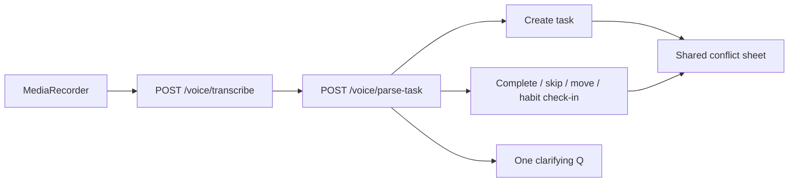

# Specification: Voice Commander

**Status:** product contract for Voice Commander (roadmap §13 shipped).  
**Language:** English  
**Last updated:** September 2026  

Voice becomes the **primary controller** for tasks and habits: full create / edit / delete plus the operational actions already supported. Placement and conflict choice stay on the shared decision layer in [spec-conflict-rules.md](spec-conflict-rules.md). HTTP details for today’s endpoints live in [api-reference.md](api-reference.md); Groq keys in [integrations.md](integrations.md).

---

## 1. Goals

- Let the user do **every task and habit manipulation** available in the UI through the same mic flow.
- Keep one pipeline: push-to-talk → STT → parse/resolve → existing write APIs (no second scheduler brain).
- Improve feedback: **Speak replies** (TTS), **mic-level equalizer** while recording, clear sheet states.
- Stay safe on destructive actions: **delete** and **cancel** always require confirmation.

## 2. Non-goals

- Schedule jobs by voice (Generate / Suggestions / Clear / Review cleanup).
- Phases CRUD or Settings changes by voice.
- Calendar Q&A (“what’s next?”, “list today’s tasks”) as free-form query — only a short confirmation after a write.
- True streaming STT / live word-by-word captions (deferred).
- Server-side TTS (deferred; client abstraction must allow a later swap).
- Equalizer on TTS playback (deferred).
- Continuous listen / wake word (push-to-talk stays).
- Rewriting mic capture or replacing Groq Whisper for final transcripts.

---

## 3. Decision log (locked)

| Topic | Decision |
|--------|----------|
| Role | Voice is the main controller: create / edit / delete + all operational actions |
| Entity scope | **Tasks + Habits** full CRUD; schedule / phases / settings out of scope |
| Task fields | All form fields (`CreateTaskDTO` / `UpdateTaskDTO`), including recurrence and Google metadata |
| Habit fields | All `CreateHabitDto` / `UpdateHabitDto` fields |
| Edit model | One utterance → immediate PATCH of mentioned fields; one clarifying question if ambiguous |
| Calendar query | No; short spoken/text confirmation after an action only |
| Delete / cancel | Always confirm (tap or second “yes”) |
| TTS | Web Speech Synthesis now + `speak()` abstraction for a future server TTS |
| What to speak | Clarifying question + confirm summary + result (success / refuse); not busy or mic errors |
| Setting | New toggle **Speak replies** (`speakVoiceReplies`); keep `confirmVoiceCommands` |
| Captions / “live” | Pseudo-live: Listening + equalizer while recording; transcript after Stop |
| Equalizer | Mic input level only |
| Conflict layer | Unchanged shared sheet; spoken option ids still work |

---

## 4. Current baseline

**Already works by voice**

| Area | Behavior |
|------|----------|
| Create | Immediate create when a name exists (defaults: 30 min, medium, no phase); one clarification for missing name |
| Complete | Named or “now/this” task; recurring “done” → skip today’s open occurrence |
| Skip / cancel | Skip occurrence or cancel task (confirm when `confirmVoiceCommands` is on) |
| Reschedule | `move` / `shift` / `window` / do-now style window + silent replan |
| Habit | `habit_check_in` by name for today in settings TZ |
| Conflict | After create/window, `conflicts[]` opens shared sheet; spoken option or tap |

**Missing vs this spec**

- Task update (partial fields), delete, reopen / arbitrary status
- Full create field coverage beyond today’s parse defaults
- Habit create / update / delete / uncheck
- TTS, Speak replies setting, mic equalizer UI
- Hard confirm for delete / cancel even when `confirmVoiceCommands` is off

Key code today: `backend/src/modules/voice/*`, `frontend/src/modules/voice/*` (`VoiceTaskSheet`, `useVoiceTask`, `executeVoiceCommand`).

---

## 5. Target intents

### 5.1 Tasks

| Intent | Resolve → `command.kind` (or create payload) | Client write |
|--------|-----------------------------------------------|--------------|
| Create | `task` payload; `command` null | `POST /tasks` (existing flow + conflict settle) |
| Update | `update` | `PATCH /tasks/:id` with partial body |
| Delete | `delete` | `DELETE /tasks/:id` after confirm |
| Complete | `complete` | `PATCH` status `completed` (or skip occurrence for recurring “done”) |
| Reopen / status | `update` with `status` (`todo` / `in_progress` / …) | `PATCH /tasks/:id` |
| Skip occurrence | `skip` | Existing skip API |
| Cancel | `cancel` | `PATCH` status `canceled` after confirm |
| Reschedule / do now | `move` / `shift` / `window` | Existing move / patch + replan |
| Conflict pick | Spoken option id (existing) | Existing conflict apply APIs |

Create and update may set **any** form field the UI can set, including: name, description, duration, phase, eventType, priority, From/Until / deadline, scheduled start/end, recurrence / weekdays, allowSplit, location, Google color / visibility / transparency / reminders, unscheduled flags when the product flow allows.

### 5.2 Habits

| Intent | `command.kind` | Client write |
|--------|----------------|--------------|
| Create | `habit_create` | `POST /habits` |
| Update | `habit_update` | `PATCH /habits/:id` |
| Delete | `habit_delete` | `DELETE /habits/:id` after confirm |
| Check-in | `habit_check_in` | `POST /habits/:id/check-ins` (existing) |
| Uncheck | `habit_uncheck` | `DELETE /habits/:id/check-ins/:date` |

Habit create/update fields: name, color, description, `blockStartTime` + `blockMinutes` (pair rules unchanged).

---

## 6. Resolve rules

- **Target:** `current` (“now” / “this”) = app task whose open slot overlaps now; otherwise **named** fuzzy match among incomplete tasks (or habits for habit intents).
- **Ambiguous name:** one clarifying question, then refuse if still unclear (same one-shot rule as today).
- **Google-only / fixed external:** refuse edits that the UI would also refuse; do not invent a parallel policy.
- **Delete / cancel:** always show confirm in the sheet (and speak the confirm summary when Speak replies is on), even if `confirmVoiceCommands` is false. Other commands still respect `confirmVoiceCommands`.
- **Edit:** parse mentioned fields only; omit untouched fields from the PATCH body.
- **Create:** if the utterance only names a title, keep today’s defaults; if it specifies more fields, include them in the create payload.
- **After write:** short confirmation string (summary) for toast + optional TTS; no calendar listing.
- **Placement:** create / window / move still use the shared conflict builder; no-reply → Problematic per conflict spec.

---

## 7. API surface

Keep `POST /voice/transcribe` and `POST /voice/parse-task`. Extend the parse response:

- Broader LLM draft intents (create stays `task` + `command: null`; add update / delete / habit CRUD drafts).
- New resolved `command.kind` values: `update`, `delete`, `habit_create`, `habit_update`, `habit_delete`, `habit_uncheck` (plus existing kinds).
- `update` / `habit_update` carry **partial** field maps aligned with existing DTOs, not a second schema.
- `delete` / `habit_delete` / `cancel` include enough identity + `summary` for the confirm UI and TTS.
- Settings: persist **`speakVoiceReplies`** (boolean, default sensible — prefer `true` when Web Speech is available is a product default; document the shipped default in api-reference when implemented).

The client continues to perform writes through existing task / habit / schedule APIs (`executeVoiceCommand` and create path). Parse does not mutate the database except via those client calls.

---

## 8. TTS (`VoiceSpeech`)

- Client module with `speak(text, lang)` / `stop()` backed by **Web Speech Synthesis**.
- Language from settings `language` (`en` | `uk`). If no suitable voice: silent fallback; sheet text still shown.
- Call `stop()` when a new recording starts or the sheet closes.
- Speak only: clarifying question, confirm summary, success / refuse result.
- Do **not** speak: “Transcribing…”, mic permission errors, raw stack traces.
- Abstraction boundary must allow swapping the implementation to a server TTS later without changing call sites.

---

## 9. UI (`VoiceTaskSheet`)

| State | UI |
|-------|-----|
| Recording | Mic equalizer (input level bars) + “Listening…” (pseudo-live; no interim STT text) |
| After Stop | Show final transcript (existing STT result), then working |
| Clarifying | Question text + optional TTS |
| Confirm | Summary for delete/cancel (always) or when `confirmVoiceCommands` | Tap Confirm / Cancel or spoken yes/no |
| Result | Success / refuse copy + optional TTS |

Equalizer is **recording-only**. Spoken assistant lines appear as sheet text when TTS runs.

---

## 10. Settings

| Key | Meaning |
|-----|---------|
| `confirmVoiceCommands` | Ask before non-create commands (existing). Does **not** waive delete/cancel confirm. |
| `speakVoiceReplies` | When on, speak clarifying / confirm / result via `VoiceSpeech`. |

Wire the Speak replies toggle next to the existing voice confirm control in Settings.

---

## 11. i18n

- UI chrome + TTS language follow settings `language` (`en` / `uk`).
- Spoken **input** remains multilingual (uk / en / ru) via Whisper + parse prompts, same as today.
- New strings: Speak replies label, Listening, confirm delete/habit delete copy, equalizer/a11y labels.

---

## 12. Tests

| Layer | Add when implementing |
|-------|------------------------|
| Unit | Resolve: update / delete / habit CRUD / uncheck; confirm-required kinds; partial field maps |
| API e2e | Parse fixtures → new `command.kind`s; refuse / clarification paths |
| Playwright | Equalizer/Listening visible while recording (stub mic if needed); Speak replies toggle; confirm on delete; update + habit create smoke with STT stub |

Extend [e2e-test-coverage.md](e2e-test-coverage.md) with new A-VOI / U-VOI rows when each phase ships. Keep conflict case `U-VOI-007` green.

---

## 13. Phased delivery

Implement in this order inside roadmap §13:

### P1 — Feedback + safety on existing commands

- `VoiceSpeech` + `speakVoiceReplies` setting
- Mic equalizer + Listening state in the sheet
- Always-confirm for **cancel** (and any delete if partially wired)
- No new CRUD intents required to close P1

### P2 — Task commander

- Parse + resolve + execute: `update`, `delete`, reopen/status
- Create path accepts full form fields from the utterance
- Confirm UX for delete; conflict layer unchanged

### P3 — Habit commander

- `habit_create`, `habit_update`, `habit_delete`, `habit_uncheck`
- Confirm for habit delete
- Check-in behavior stays as today

Ship docs updates (api-reference, overview, e2e coverage) with each phase.

---

## 14. Deferred

- Streaming / Web Speech Recognition interim captions
- Server TTS behind the same `speak()` API
- Equalizer (or waveform) during TTS playback
- Schedule / phases / settings by voice
- Free-form “what’s on my calendar” queries
- Continuous listening

---

## 15. Must not break

- Existing create / complete / skip / reschedule / habit check-in / conflict voice flows
- Shared conflict sheet contract ([spec-conflict-rules.md](spec-conflict-rules.md))
- Settings IANA `timeZone` as the parse calendar day source
- One clarifying question maximum, then refuse
